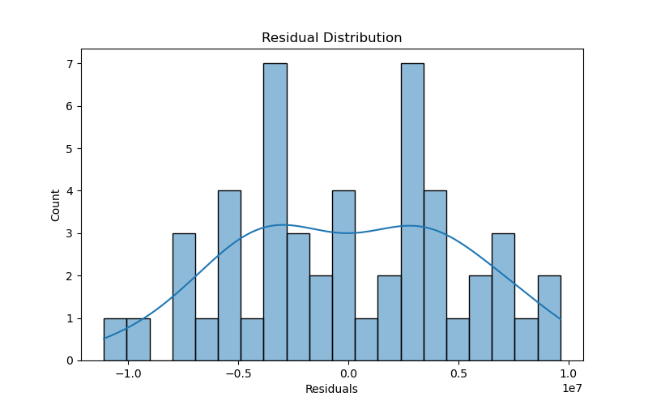
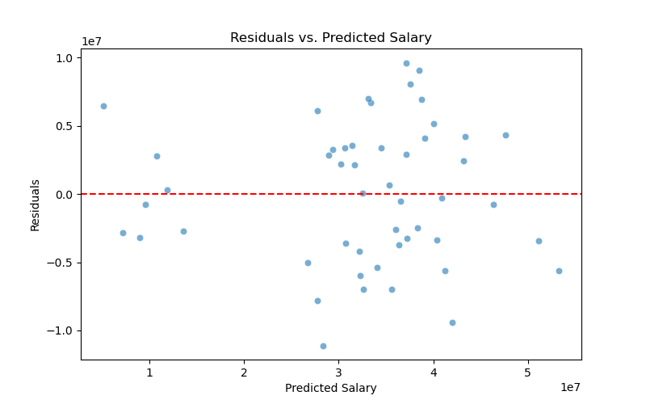

# Predicting NBA Salaries: A Multivariable Regression Analysis

Wil Sheffield  
May 2024

## Overview

This project applies **multivariable linear regression** to estimate the salaries of the **top 50 NBA players** for the **2023-2024 season**. Using **Python (Pandas, NumPy, SciPy, Statsmodels)**, it analyzes **player statistics, attributes, and categorical factors** to predict salary values.  

The goal is to **determine which factors best explain salary variations** and assess the significance of various performance metrics.  

**Key Research Question:**  
*Can NBA player salaries be effectively estimated using statistical modeling based on their in-game averages, attributes, and categorical variables such as position or market size?*

---

## Data Sources

The data was collected from **trusted sports analytics sources**:

- **Salary Data:** [Spotrac NBA Contracts](https://www.spotrac.com/nba/contracts)
- **Player Statistics:** [Basketball-Reference](https://www.basketball-reference.com/players/)
- **Top 50 Players List:** [ESPN NBArank 2023](https://www.espn.com/nba/story/_/id/38625043/nbarank-2023-player-rankings-2023-24-50-11)

---

## Repository Structure

```
│── Results/
│   │── multicollinearity_vif.csv     # VIF results for multicollinearity
│   │── regression_results.txt        # Regression output
│   │── residual_distribution.png     # Histogram of residuals
│   │── residuals_plot.png            # Residuals vs. predicted salary
│── 01_final_code.py                  # Main Python script
│── 02_data.csv                       # Raw dataset of player statistics & salaries
│── 03_final_report.pdf               # Post-analysis report
│── 04_final_presentation.pdf         # Pre-analysis presentation
│── README.md                         # Project overview (this file)

```

---

## Methodology

### **1) Selecting the Sample**
To ensure a **meaningful and statistically significant analysis**, we focused exclusively on the **top 50 NBA players** based on ESPN’s NBArank 2023. This ensures that:
- Players have **well-documented performance metrics**.
- Salary discrepancies are **more predictable** due to their elite status.
- The sample consists of **higher-paid players**, where variance in salary is meaningful.

### **2) Independent Variables**
The model includes **16 independent variables** categorized into **performance metrics, advanced stats, attributes, and categorical indicators**:

| **Category**           | **Variable** |
|----------------------|-------------|
| **Per-Game Stats**  | Points per Game (PPG), Assists per Game (APG), Rebounds per Game (RPG), Blocks + Steals per Game (BSPG) |
| **Advanced Metrics** | True Shooting % (TS%), Player Efficiency Rating (PER), Win Shares per 48 Minutes (WS/48) |
| **Player Attributes** | Age, Seasons Played, Draft Position, All-Star Selections, Games Played |
| **Categorical Dummies** | Guard Position (1 = Guard), Forward Position (1 = Forward, 0 = Center), Big Market Team (1 = Yes), Rookie Deal (1 = Yes) |

### **3) Regression Model**
We used **Ordinary Least Squares (OLS) regression** to estimate salaries. The regression equation:

$$
Salary = \beta_0 + \sum \beta_i X_i + \epsilon
$$

where:
- $X_i$ are the **independent variables** (performance metrics, attributes, and categorical factors).
- $\beta_i$ represents the **estimated effect** of each variable.
- $\epsilon$ is the **error term**.

---

## Results & Findings

| **Metric** | **Value** |
|-----------|----------|
| **R² (Goodness of Fit)** | 0.824 (82.4% of salary variance explained) |
| **F-statistic p-value** | 2.88e-08 (**Statistically significant**) |
| **Most Significant Predictor** | *Rookie Deal (p < 0.001, large negative coefficient)* |
| **Collinearity Concerns?** | **Yes** (high correlation between some stats) |

- The model **explains 82.4% of the variance** in NBA player salaries.
- The **only statistically significant variable** was **Rookie Deal**, showing a **strong negative impact on salary** (rookie contracts are salary-capped).
- **Multicollinearity is present**, as expected, since many basketball statistics are interconnected (e.g., players who score more also get more assists).

---

## Visualizations

### **Residual Analysis**
To evaluate the **appropriateness of the linear model**, we conducted **residual diagnostics**.

#### Residual Distribution
Shows the **spread of residuals**—should be **normally distributed**.



#### Residuals vs. Predicted Salary
Checks for **heteroskedasticity** (variance in residuals should be constant).



---

## Key Takeaways

1) **Multivariable regression provides a strong but imperfect estimate of NBA salaries.**  
- The **model explains 82.4%** of salary variation.
- **Significant multicollinearity** affects individual variable significance.

2) **Rookie contracts heavily impact salary predictions.**  
- Being on a **rookie deal reduces salary** significantly.
- **Other factors (PPG, All-Star selections, efficiency metrics) were not statistically significant.**

3) **Future Improvements**  
- Using **regularization techniques** (Ridge, Lasso) to reduce multicollinearity.
- Exploring **non-linear models** (e.g., Random Forest, XGBoost) for better predictions.

---

## **Limitations & Challenges**
While the model provides a strong foundation for predicting NBA salaries, several challenges and limitations should be acknowledged:

### **1) Multicollinearity Among Independent Variables**
- Many basketball statistics are **highly correlated** (e.g., players with high PPG often have high PER, TS%, and WS/48).
- This collinearity can cause **inflated coefficient estimates** and **lower individual statistical significance**, despite the model explaining a large proportion of salary variance.
- **Solution Consideration:** Regularization techniques like **Ridge/Lasso regression** to reduce variance inflation.

### **2) Salary Influences Beyond Performance Metrics**
- NBA player salaries are not determined purely by stats—**endorsements, team branding, leadership, and marketability** play a major role.
- Players with high commercial value (e.g., **LeBron James, Stephen Curry**) may earn significantly more than players with similar performance.
- **Solution Consideration:** Incorporating external data on **endorsement deals, jersey sales, and market impact**.

### **3) Limited Sample Size (Top 50 Players Only)**
- The dataset only includes the **top 50 NBA players** based on ESPN’s NBArank 2023.
- While this ensures higher salaries and robust performance data, it excludes **role players and mid-level contracts**, which might behave differently in salary regression.
- **Solution Consideration:** Expanding the dataset to **include 200+ players** for a broader salary distribution.

### **4) Missing Context on Contract Structures**
- The model does not account for **salary cap rules, contract bonuses, player/team options, and max contract restrictions**.
- Rookie deals are inherently capped, leading to their **overwhelming statistical significance in the model**.
- **Solution Consideration:** Introducing **contract-type categories** (e.g., max contract, mid-level exception, veteran minimum) to refine the predictions.

### **5) Potential Heteroskedasticity in Residuals**
- The **Residuals vs. Predicted Salary plot** suggests that variance in residuals **may increase for higher salaries**.
- This could indicate **heteroskedasticity**, meaning that **prediction errors are not evenly distributed across salary levels**.
- **Solution Consideration:** Applying **Weighted Least Squares (WLS) regression** to stabilize variance.

---

## Running the Analysis

### **1) Install Dependencies**
Ensure you have **Python 3+** and install the required libraries:

```bash
pip install pandas numpy scipy statsmodels matplotlib seaborn
```

### **2) Run the Script**
Execute the main script:

```bash
python nba_salary_predictor.py
```

This script will:
- Load **02_data.csv**
- Perform **regression analysis**
- Generate **residual plots and VIF calculations**
- Output **results in the `Results/` folder**

---
